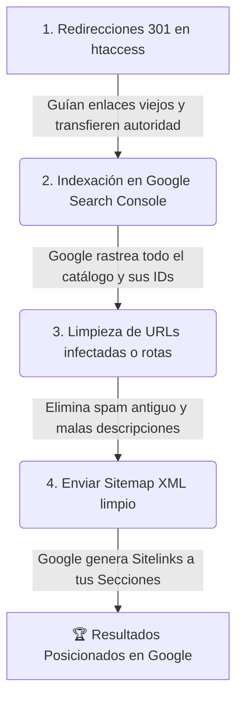

# 🚀 Plan de Acción SEO y Posicionamiento de Secciones
**Proyecto:** Life Fitness Venezuela (`lifefitness.com.ve`)  
**Páginas Principales:**  
1. `https://lifefitness.com.ve/` (Inicio)  
2. `https://lifefitness.com.ve/gimnasio` (Línea Comercial / Fuerza y Cardio)  
3. `https://lifefitness.com.ve/hogar` (Línea Hogar / Gimnasio en Casa)  

---

## 🎯 ¿Cómo posicionar secciones específicas (#anclas) si solo tengo 3 URLs base?

### La regla de oro de Google con los `#` (Anclas / Fragmentos):
> **Google indexa URLs base (`/gimnasio`, `/hogar`, `/`), pero NO indexa el `#` por separado en el Sitemap.**
> Sin embargo, **Google premia las páginas bien estructuradas creando "Sitelinks de sección" y fragmentos destacados** en los resultados de búsqueda.
> 
> Cuando Google rastrea `https://lifefitness.com.ve/gimnasio`, lee todos los encabezados con IDs (`id="trotadoras"`, `id="serie-selectorizada"`, `id="bicicletas-verticales"`, `id="elipticas"`). Cuando un usuario busque en Google *"Trotadoras Life Fitness Venezuela"*, Google mostrará la página de `/gimnasio` y un enlace directo a la sección `#trotadoras`.

---

## 📋 Plan Detallado de los 4 Pasos



---

### 1️⃣ Paso 1: Configurar Redirecciones 301 (Imprescindible)
> **Estado:** ✅ **Completado en `.htaccess` y en React Router**

#### ¿Para qué sirve?
Las personas y Google que hagan clic en búsquedas antiguas como `https://lifefitness.com.ve/bicicletas-de-ejercicio-lifecycle` o `https://lifefitness.com.ve/equipos-para-el-hogar` son redirigidos automáticamente y sin pantalla en blanco:
- Enlaces de Bicicletas ➡️ `https://lifefitness.com.ve/gimnasio#bicicletas-verticales`
- Enlaces de Hogar / Domésticos ➡️ `https://lifefitness.com.ve/hogar`
- Enlaces de Planos / Diseños ➡️ `https://lifefitness.com.ve/gimnasio#serie-selectorizada`
- Enlaces de Caminadoras / Trotadoras ➡️ `https://lifefitness.com.ve/gimnasio#trotadoras`
- Enlaces de Elípticas ➡️ `https://lifefitness.com.ve/gimnasio#elipticas`
- Enlaces viejos no reconocidos o spam ➡️ `https://lifefitness.com.ve/`

---

### 2️⃣ Paso 2: Solicitar Indexación en Google Search Console para Secciones
> **Estado:** ⏳ **Paso a realizar en el Panel de Google Search Console**

#### ¿Cómo solicitar la indexación de tus 3 páginas para que Google indexe todos tus productos y secciones?

1. Entra a [Google Search Console](https://search.google.com/search-console).
2. En la barra superior de búsqueda **"Inspeccionar cualquier URL de https://lifefitness.com.ve/..."**, ingresa **una por una** las 3 URLs oficiales:
   - `https://lifefitness.com.ve/`
   - `https://lifefitness.com.ve/gimnasio`
   - `https://lifefitness.com.ve/hogar`
3. Presiona **Enter** en cada una. Google analizará la página en vivo.
4. Haz clic en el botón **"SOLICITAR INDEXACIÓN"** (*Request Indexing*).

#### ¿Qué ocurre internamente?
Al inspeccionar `https://lifefitness.com.ve/gimnasio`, el robot de Google (Googlebot) ejecuta el JavaScript de React, descubre todos los productos cargados desde la base de datos y reconoce las siguientes secciones por su `id`:
- `#trotadoras` (Trotadoras / Caminadoras)
- `#elipticas` (Elípticas)
- `#bicicletas-verticales` (Bicicletas de Ejercicio)
- `#bicicletas-reclinadas` (Bicicletas Reclinadas)
- `#ciclismo-indoor` (Ciclismo Estacionario / Ciclo)
- `#serie-selectorizada` (Serie Selectorizada / Máquinas de Fuerza)
- `#placas` (Equipos de Placas)
- `#bancos-y-racks` (Bancos y Racks)
- `#multigimnasios` (Multigimnasios / Multifuerzas)
- `#remos` (Remos)

---

### 3️⃣ Paso 3: Eliminar URLs Inexistentes o Infectadas de Google
> **Estado:** ⏳ **Paso a realizar en el Panel de Google Search Console**

En los resultados de búsqueda antiguos se observa texto de spam (como *"Idn Slot..."* en el enlace de Elípticas del sitio web previo). Debes pedirle a Google que borre temporalmente los datos en caché de esas páginas antiguas.

#### Instrucciones paso a paso:
1. En Google Search Console, en el menú lateral izquierdo, ve a **Indexación** ➡️ **Retiradas de URLs** (*Removals*).
2. Haz clic en el botón rojo **"Nueva solicitud"**.
3. Selecciona la pestaña **"Borrar URL de la caché"** (o *"Clear cached URL"*):
   - Esto mantiene tu enlace pero **elimina de inmediato el texto viejo de spam y la descripción infectada** de los resultados de Google, forzando a Google a mostrar el nuevo contenido de Life Fitness Venezuela cuando vuelva a rastrear la página.
4. Ingresa las URLs que tenían textos erróneos o infectados:
   - `https://lifefitness.com.ve/elipticas/`
   - `https://lifefitness.com.ve/bicicletas/`
   - `https://lifefitness.com.ve/planner-desing/`
   - `https://lifefitness.com.ve/equiposdomesticos/`
5. Haz clic en **Siguiente** ➡️ **Enviar solicitud**.

---

### 4️⃣ Paso 4: Actualizar y Enviar el Sitemap XML Oficial
> **Estado:** ✅ **Archivo listo en servidor** / ⏳ **Envío en GSC**

#### ¿Por qué el Sitemap debe contener exactamente las 3 URLs limpias?
Los estándares de Google para Sitemaps (`sitemaps.org`) exigen que las URLs enviadas respondan con código `200 OK` directo y no contengan símbolos `#`. 

El archivo `public/sitemap.xml` ya tiene configuradas las URLs oficiales:
```xml
<?xml version="1.0" encoding="UTF-8"?>
<urlset xmlns="http://www.sitemaps.org/schemas/sitemap/0.9">
  <url>
    <loc>https://lifefitness.com.ve/</loc>
    <lastmod>2026-08-23</lastmod>
    <changefreq>weekly</changefreq>
    <priority>1.0</priority>
  </url>
  <url>
    <loc>https://lifefitness.com.ve/gimnasio</loc>
    <lastmod>2026-08-23</lastmod>
    <changefreq>weekly</changefreq>
    <priority>0.9</priority>
  </url>
  <url>
    <loc>https://lifefitness.com.ve/hogar</loc>
    <lastmod>2026-08-23</lastmod>
    <changefreq>weekly</changefreq>
    <priority>0.9</priority>
  </url>
</urlset>
```

#### Instrucciones para reenviarlo en Google Search Console:
1. En el menú lateral izquierdo de Search Console, ve a **Indexación** ➡️ **Sitemaps**.
2. En **"Añadir un nuevo sitemap"**, escribe:
   `sitemap.xml`
3. Haz clic en **ENVIAR**.
4. Verás el estado en verde: **"Correcto"**.

---

## 🏆 Resumen: ¿Cómo aparecerán tus secciones en Google?

Una vez completados estos pasos:
1. **Búsqueda de marca ("Life Fitness Venezuela")**:
   Google mostrará el resultado principal (`/`) con accesos directos (*Sitelinks*) hacia **Equipos de Gimnasio** (`/gimnasio`) y **Equipos de Hogar** (`/hogar`).
2. **Búsqueda de categorías ("Trotadoras Life Fitness", "Bicicletas de ejercicio", "Multifuerzas")**:
   Google posicionará directamente la URL `/gimnasio` o `/hogar`, desplazando automáticamente la pantalla del usuario hasta la fila de productos de esa categoría gracias al componente [ScrollToHash.jsx](file:///c:/Users/Lenovo/Desktop/lifefitnes%20venezuela/src/components/ScrollToHash.jsx).
3. **Búsquedas de enlaces viejos**:
   Cualquier persona que haga clic en un enlace viejo en Google será redirigida (301) instantáneamente al producto exacto en la nueva web.
